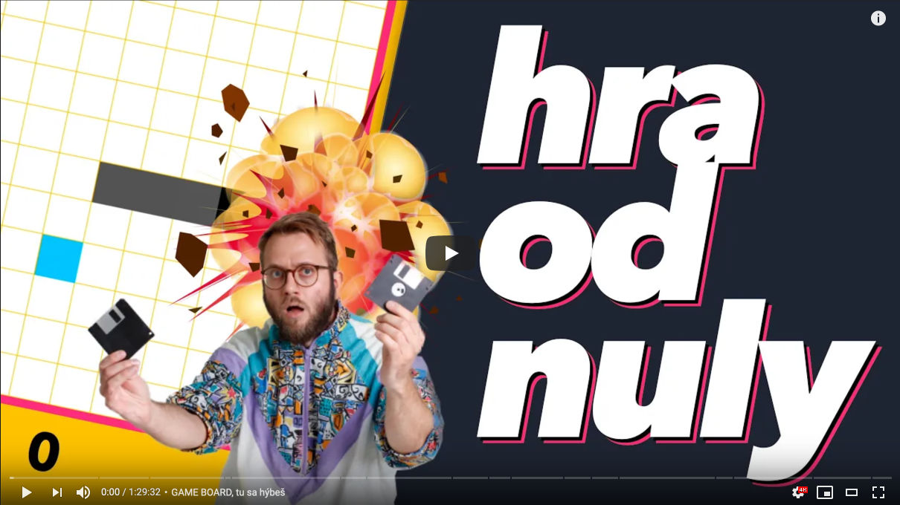

# Sprav si hadíka v JavaScripte! Naučím ťa
### my absolute snake son 🐍

Naučím ťa spraviť si hru. Od nuly. Vysvetlím každý krok. Nepotrebuješ engine, framework, ani iné veľké slovo. Stačí ti internetový prehliadač a niečo, kam vieš text písať. Ak nie si programátor, tak si šťastný človek. Ale taktiež nemusíš byť, dám ti základy priamo vo videu. Aj pár game dev konceptov, ktoré si môžeš zobrať do "ozajstného" enginu. A možno sa ti miestami aj kútiky úst ohnú do tvaru vágne pripomínajúceho úsmev! Ak nie, zlyhal som a môj otec je zo mňa (zase) sklamaný. Whoops!!
  
Baví ma to. Viem, že som to video spravil ja, ale baví ma. Rozmýšľam, že medzi každý väčší kurz strčím menšiu hru. Treba sa naučiť hrať sa v tomto svete ťažkom, čo ti poviem. Všeličo! Vo videu!

---

### VIDEO, kde ťa naučím hadíka spraviť, krok za krokom:
  
:: https://youtu.be/D-dtyO44ANA

  
### ZAHRAJ SA hadíka, šoféruj ho:
  
:: https://yablko.github.com/not-so-solid-snake/

V branchoch vidíš, ako sa kód vyvíjal.

---

Ak si učiteľ, môžeš tento kód a video používať na škole, ako len chceš. Enjoy!  
Ak ma chceš podporiť, a nemusíš byť učiteľ, **hoď po mne groš cez ♥️ [patreon](https://www.patreon.com/yablko)**.  
Sľubujem, že to možno nie je kult a patróni majú moje videá a kurzy skôr. A môžu mi kydať do vecí. A dávam im tipy, rady, odporúčania, backstage veci a spomínal som, že to možno nie je kult? 

---

### Chceš sa zlepšiť v programovaní?  

Chyť môj kód a vylepši hada.  
Pár nápadov, čo s ním môžeš spraviť:  
  
**a) ZAGUĽAŤ HADA**
  
Had je štvorcový. Zmeň ho na okrúhleho.  
Namiesto štvorca nakresli kruh.  
Sprav novú funkciu, ktorá namiesto rektángla nakreslí kruh.  
  
**b) NAKÚR TO DO STENY**  
  
Cez steny môžeš prechádzať. Zmeň to.  
Že hra skončí, keď narazíš do steny.  
  
**c) HAD PALCOM**  
  
Keď hru otvoríš na mobile, zaplačeš.  
Zatiaľ sme klávesnicoví.  
Skús hru zmeniť tak, že ju môžeš ovládať palcom na mobilných divajces.  
  
**d) FAST AND FURIOUS**  
  
Sprav, nech had pridá vždy, keď zoberieš jedlo.  
Nažereš sa a stlačíš Vin Diesel turbo gombík.  
Odporúčam limitovať maximálnu možnú rýchlosť.  
Not too fast not too furious.  
  
**e) SKONTROLUJ KOLÍZIE**  
  
Mám tušenie, že kolízie so stenami stále nie sú úplne správne?  
Tvoja úloha je jednak zistiť, či je moje tušenie správne.  
A ak je, tak opraviť chybu.  
  
**f) VAŠO**  
  
Pridaj zvuky.  
Prípadne hudbu.  

---
  
**KURZY, ktoré spomínam vo videu (trochu si spravím reklamu)**
  
HTML/CSS skús ZDARMA https://www.youtube.com/playlist?list=PL3VwAXKvhemVw5DnAqeGbZx5AgEQT27xF  
WEBREBEL kurz tu https://www.learn2code.sk/kurzy/webrebel-1-html-css-javascript  
JavaScript a ES6 kurz https://www.learn2code.sk/kurzy/online-kurz-javascript-es  
Všetky moje learn2code kurzy https://www.learn2code.sk/instruktori/roman-hraska 1300+ videí  
Predplatné (dostaneš všetko, čo existuje) https://www.learn2code.sk/predplatne  
Tu nájdeš kopu ukážok z mojich kurzov, skús si ich ZDARMA https://www.youtube.com/c/Yablko/playlists?view=1&sort=dd&shelf_id=0
  
